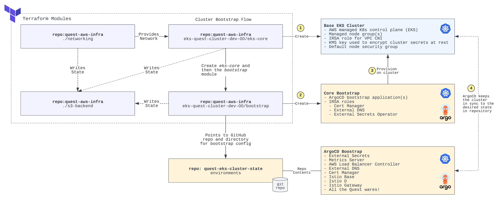

- [Links](#links)
- [A Quest in the Clouds](#a-quest-in-the-clouds)
  - [Wish List](#wish-list)
  - [Quest Tasks](#quest-tasks)
  - [Provisioning Flows](#provisioning-flows)
    - [CI/CD](#cicd)
    - [ArgoCD](#argocd)

# Links
For easy reference, but please go through this README first!

| Component | Link                            | Notes                                |
|-----------|---------------------------------|--------------------------------------|
| Quest App | https://node.quest.defimagi.com | Running on EKS, https redirect works |
| ArgoCD    | https://argo.quest.defimagi.com | ArgoCD GUI to view bootstrap config  |

# A Quest in the Clouds
So what was this journey all about? The asks were clearly outlined but there is some learning that I wanted to get out of this exercise as well; what were those goals and how did I do?


> "Journey before destination." - First Ideal of the Immortal Words

**Goal 01**

Learn basic GitHub actions workflows
- Kept hearing how awesome these were so I wanted to try out the workflows

Outcome: Success! Able to build, version and deploy the containerized Quest app to EKS using Actions. I haven't built pipelines in a while, this was a good refresher.

**Goal 02**

Use [Podman](https://podman.io/getting-started/) instead of Docker 
- It's like Docker, but better, right?

Outcome: Semi-success! Was able to build the Podman container but not able to test it locally on M1 silicon. Podman only runs on linux and in order to do builds on Mac it requires a VM - port forwarding wasn't working correctly, switched to Docker to avoid time sink. Overall this seems like a good alternative to Docker, you can even use the same commands.

**Goal 03**

Route Ingress traffic using Istio via load-balancer provisioned in the public subnets
- Have been able to provision and route traffic in internal subnets in another project, public shouldn't be hard right?

Outcome: Failed! Was not able to provision a working pattern. Wanted to setup a centralized ingress that would work in any Namespace with the correct annotations on Istio Gateway objects, but ran into the issue with HTTPS traffic. Able to route using HTTP but HTTPS had `ERR_CONNECTION_RESET` error when navigating to anything fronted with Gateway/VirtualService. Spent a good amount of time troubleshooting but didn't have any luck. Went with backup plan and rolled out NGINX. This was a big bummer for me, will probably poke at this a little bit more when I have time.

**Goal 04**

Demonstrate ArgoCD GitOps based bootstrap pattern. 
- Bootstrapping cluster with Terraform can become fragile, there has to be a better way right?

Outcome: Success! Barebones bootstrapping with Terraform --> point cluster to source of truth Git repo --> magic. More details below!

## Wish List
What else I wanted to do but didn't get to:
- Use free tier of Terraform Cloud to automate TF deploys
- Use free tier of Datadog to monitor the cluster

## Quest Tasks
The really important bits, how did I do on the tasks?

1. If you know how to use git, start a git repository (local-only is acceptable) and commit all of your work to it.
   - [quest-node-app](https://github.com/defi-magi/quest-node-app): the application, Dockerfile, Helm chart, and GitHub actions to build and deploy the app
   - [quest-eks-modules](https://github.com/defi-magi/quest-eks-modules): the TF modules used to provision EKS and bootstrap the cluster using ArgoCD
   - [quest-aws-infra](https://github.com/defi-magi/quest-aws-infra): the repo that calls the TF modules to provision them. This repo also includes a Route53 zone and leverages an upstream VPC module
   - [quest-eks-cluster-state](https://github.com/defi-magi/quest-eks-cluster-state): the cluster bootstrap configuration structure that ArgoCD points to for the app-of-apps pattern
2. Deploy the app in any public cloud and navigate to the index page. Use Linux 64-bit x86/64 as your OS (Amazon Linux preferred in AWS, Similar Linux flavor preferred in GCP and Azure)
   - The app is deployed to AWS EKS running in my account, the app can't infer that it's running in the context of AWS unfortunately
   - I should have just spun up the container real quick on an EC2 to grab this but ran out of time
   - I will keep the cluster operational until end of interview process

Here are the app pods running on the managed node group EC2s:
```
NAME                               STATUS    NODE
quest-node-apps-55c99755cb-dk8t8   Running   ip-10-0-1-58.ec2.internal
quest-node-apps-55c99755cb-g7tfl   Running   ip-10-0-2-178.ec2.internal
quest-node-apps-55c99755cb-mqhgd   Running   ip-10-0-3-97.ec2.internal
```

Navigate here to view the app: https://node.quest.defimagi.com

3. Deploy the app in a Docker container. Use `node` as the base image. Version `node:10` or later should work.
   - Containerized using `node:10` 
4. Inject an environment variable (`SECRET_WORD`) in the Docker container. The value of `SECRET_WORD` should be the secret word discovered on the index page of the application.
   - Index page does not recognize the instance metadata since it's an abstracted container running on EKS, but I was able to mount my own Secret from Secrets Manager
   - `This is running in EKS - the index page doesn't recognize it as public cloud.` when you navigate to https://node.quest.defimagi.com/secret_word
5. Deploy a load balancer in front of the app.
   - Routing traffic with NGINX and AWS NLB
   - NLB is in public subnets and node group is in private subnets
   - Nodes and Pods are load balanced across 3 AZs
6. Use Infrastructure as Code (IaC) to "codify" your deployment. Terraform is ideal, but use whatever you know, e.g. CloudFormation, CDK, Deployment Manager, etc.
   - Entire project captured in Terraform code, EKS cluster bootstrapped using ArgoCD
7. Add TLS (https). You may use locally-generated certs.
   - Using cert-manager with LetsEncrypt on the quest.defimagi.com domain
   - Certificates pre-populated by bootstrap process
     - Automatically issued by cert-manager using txt record validation in the quest.defimagi.com sub-domain
   - External DNS automatically populates A records for Ingress objects

## Provisioning Flows
What's actually happening?

### CI/CD
1. Commit on `main` branch triggers GitHub Actions defined in the [.github/templates/cicd-docker.yaml](.github/workflows/cicd-docker.yml)
2. CI
   - Dockerfile is used to build the Quest app
   - Semantic versioning is used to bump the version
3. CD
   - Kubeconfig created from environment variable
     - ServiceAccount from which the Kubeconfig is generated from is scoped only to the `quest-node-apps` Namespace
   - Helm installed
   - App deployed using Helm
     - Subchart for secret goes first
     - Main application is then deployed

### ArgoCD
The diagram below captures the high level flow and pattern for how the infrastructure is provisioned.

